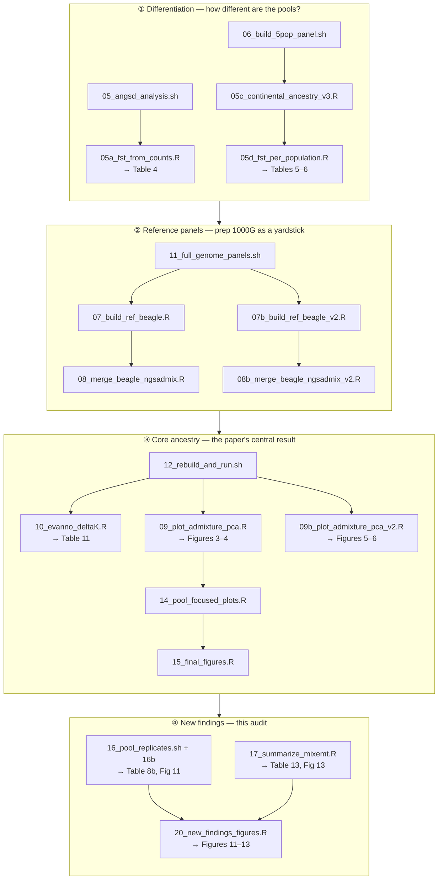

# Pipeline used to build the manuscript

This repository contains **only the scripts that generated the tables and
figures in the manuscript** (`manuscrito_G3/manuscript_en/manuscript_full.md`
and the extended `manuscript_full_v2_with_new_results.md`, not included in
this code-only repo — see `DATA_AVAILABILITY.md`). Everything else audited
during development (obsolete iterations, the iAdmix/GATK pipeline, and the
chromosome X/Y extensions that failed validation) was intentionally left
out — see `.gitignore` for the full excluded list and the reasoning.

## Pipeline map

Inputs: 3 pool BAMs (POOL1, POOL2, HOSPITAL) and 1000 Genomes Phase 3
(public, streamed remotely). Four stages, run top to bottom; arrows inside
each stage are run order, `→` labels are what lands in the manuscript.

## Pipeline, by script number

The number in each filename is its position in the original, larger
pipeline (00-20). Numbers 00-04, 13, 18, and 19 are intentionally absent —
see "What's excluded" below for why. Letters (`a`/`b`/`c`/`d`) mark
variants of the same numbered step (e.g. `07` and `07b` are the continental
and granular versions of the same reference-Beagle step), not new steps.
The table is ordered by actual run order, which mostly but not strictly
follows the numbers (`06` needs to run before `05c`/`05d`, for example).

| Script | What it produces |
|---|---|
| `05_angsd_analysis.sh` | Per-pool allele frequencies, ACGT counts, IBS, SAF/SFS (autosomes; also supports `--chr X` for the chromosome X FST result) |
| `05a_fst_from_counts.R` | Table 4 — inter-pool FST (Hudson-Bhatia, from counts) |
| `06_build_5pop_panel.sh` | FST reference panel: HapMap3 (8 pops) + 1KGP (5 superpopulations) |
| `05c_continental_ancestry_v3.R` | Continental AIMs from counts |
| `05d_fst_per_population.R` | Tables 5-6 — FST vs. 5 superpopulations and 13 individual reference populations |
| `11_full_genome_panels.sh` | Full-genome (chr1-22) 1KGP genotype extraction for the NGSadmix reference panels |
| `07_build_ref_beagle.R` | Continental reference Beagle (100 individuals, 5 superpopulations) |
| `07b_build_ref_beagle_v2.R` | Granular reference Beagle (110 individuals, 11 populations) |
| `08_merge_beagle_ngsadmix.R` | Merges pools + continental reference Beagle |
| `08b_merge_beagle_ngsadmix_v2.R` | Merges pools + granular reference Beagle |
| `12_rebuild_and_run.sh` | Full pipeline: rebuilds both reference Beagles, merges, runs NGSadmix (K=2-5 continental, K=2-11 granular) and PCAngsd, runs Evanno replicates |
| `10_evanno_deltaK.R` | Table 11 — Evanno ΔK method for optimal K |
| `09_plot_admixture_pca.R` | Figures 3-4 — continental (K=5) admixture + PCA plots |
| `09b_plot_admixture_pca_v2.R` | Figures 5-6 — granular (K=6) admixture + PCA plots |
| `14_pool_focused_plots.R` | Pool-composition plots from the K=5 result |
| `15_final_figures.R` | Final manuscript figure set |
| `16_pool_replicates.sh` + `16b_summarize_replicates.R` | Table 8b, Figure 11 — jackknife uncertainty for the K=5 proportions |
| `17_summarize_mixemt.R` (+ `mixemt` install) | Table 13, Figure 13 — mitochondrial haplogroup composition |
| `20_new_findings_figures.R` | Figures 11-13 — jackknife, chromosome X FST, and mtDNA figures |

`lib_build_ref_beagle_panel.R` is a shared helper used by `07`/`07b`/`11`/`12`
(not run directly).

## Software versions and setup

See `README.md` for exact tool versions (ANGSD, PCAngsd, bcftools/samtools,
R, mixemt) and installation commands.

## What's excluded, and why

- **`bin/archive/`** and a long tail of duplicate/superseded scripts
  (different pool sizes, filters, backups) — obsolete iterations found
  during a code audit, never the version actually used.
- **The iAdmix/GATK pipeline** (`iadmix_master_script.sh`, `run_iadmix_*.sh`,
  `00`-`04` numbered scripts, etc.) — a complementary method whose results
  are explicitly *not* part of this manuscript (mentioned only as "available
  as separate supplementary material").
- **`05a_fst_from_maf.R`** — an earlier FST approach (MAF-based)
  superseded by the counts-based `05a_fst_from_counts.R` actually used.
- **`05b_compare_angsd_iadmix.R`**, **`13_pca_3d.R`** — exploratory analyses
  not cited in the manuscript.
- **`18_build_X_panel_and_run.sh`, `19a_prepare_y_markers_and_counts.sh`,
  `19_y_haplogroup_mixture.R`** — extensions to chromosomes X and Y built
  and run during the audit, but their results failed a basic sanity check
  (see git history / commit messages for the full explanation) and are not
  in the manuscript.

## ⚠️ Methodological limitation: pools treated as diploid pseudo-individuals

`NGSadmix` and `PCAngsd` consume the Beagle format, which encodes only 3
states per site (AA/Aa/aa) — diploid by design. Each pool (POOL1/POOL2/
HOSPITAL: 50, 50 and 200 real individuals) is represented as **a single diploid
pseudo-individual**, not a weighted population frequency. This is not a bug
fixable with a flag — there is no way to tell NGSadmix/PCAngsd "this is a
pool of 50 people."

- Analyses based on direct ACGT counts (`05a_fst_from_counts.R`,
  `05c_continental_ancestry_v3.R`) **do not have this problem**.
- `bin/16_pool_replicates.sh` quantifies uncertainty via a delete-one-
  chromosome block jackknife (22 replicates). It does **not** correct the
  underlying pseudo-individual bias — it only measures how much the
  estimate varies with which part of the genome is used.

See the header comment in each script for the full warning text.

## Revised analysis (Phase 2 of the September 2026 revision memo)

Scripts `30`–`39` replace the ancestry and differentiation results above as
primary evidence; NGSadmix/PCAngsd (`07`–`15`) become exploratory. Run all of
it with `bash bin/39_run_revision.sh`. Outputs go to `out_global/revision/`.

| Script | What it does | Memo items |
|---|---|---|
| `30_build_oriented_sites.R` | 640k HGDP SNPs coded once as ancestral/derived; unadmixed proxies AFR (Yoruba, Mandenka), EUR (French, Basque, Italian, Tuscan, Sardinian), NAT (Maya, Pima, Karitiana, Surui, Colombian) | A4, A7 |
| `31_extract_pool_counts.sh` | ACGT read counts of each pool at those sites, zeros kept | A5 |
| `32_build_common_mask.R` | One mask for every pool and analysis; QC summary | A6, C1 |
| `33_ancestry_counts.R` | Beta-binomial ancestry model with real pool sizes, block jackknife, Delta_HUN and POOL1-POOL2, effective pool sizes | A2, A9 |
| `34_fst_poolfstat.R` | poolfstat ANOVA FST with block jackknife | A3 |
| `35_depth_matched.R` | Site-by-site depth matching (hypergeometric thinning) | A10 |
| `36_sensitivity.R` | Transversions, depth/QC/MAF filters, alternative proxies, block size, reference-bias diagnostic | S7, S8 |
| `37_simulate_validation.R` | Simulation of the full design; writes a small synthetic test set | A8, C5 |
| `38_fst_references.R` | Pool-vs-HGDP Hudson FST on the common mask (supplement) | A6 |
| `lib_poolmix.R` | Shared model, jackknife and block helpers | — |

Pool sizes used everywhere: POOL1 = 50, POOL2 = 50, HOSPITAL = 200 people.
